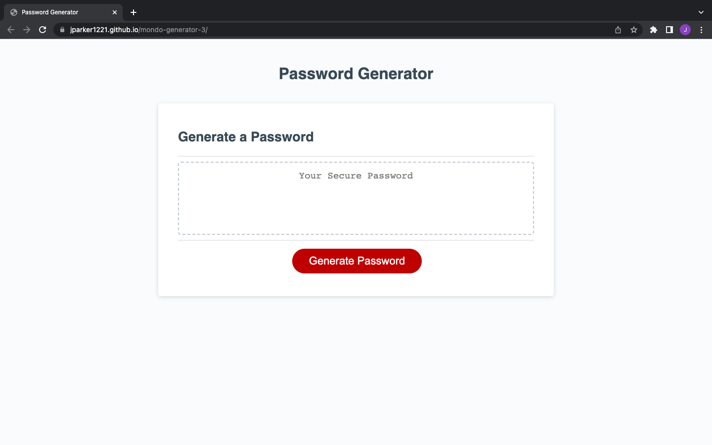

# mondo-generator-3

## Description

My motivation for this project was to build a password generator that creates a random password for the user based on a series of prompts that determine whether or not to include lowercase letters, uppercase letters, numbers, and special characters.

## Installation

N/A

## Usage

https://jparker1221.github.io/mondo-generator-3/

## Credits

N/A

## License

N/A